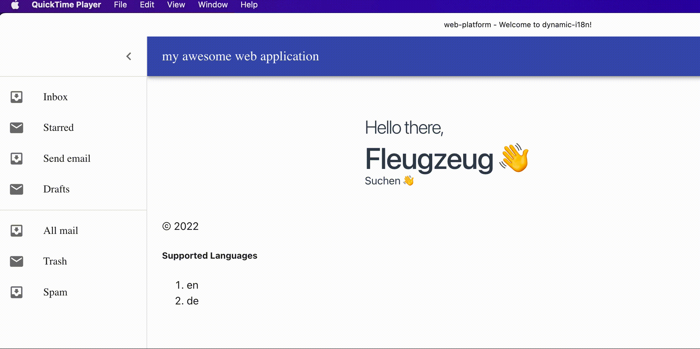

#  nx-next-pwa-i18n-platform

## Features

- [x] Develope at scale using monorepository pattern
- [x] support PWA
- [x] support Internationalization
  - get localized version of content from CMS
- [ ] cypress tests
- [x] design-system / component library
- [x] live previews using storybook
- [x] Automatic changelog generation for release

## Issues

1. [How to sign tags using @jscutlery/semver](https://github.com/jscutlery/semver/issues/489)

#### :v: Get in touch with me

- [Github](https://github.com/avimehenwal/)
- [My Website](https://avimehenwal.in)
- [My Blog v2](https://avimehenwal2.netlify.app/)
- [Twitter Handle](https://twitter.com/avimehenwal)
- [LinkedIn](https://in.linkedin.com/in/avimehenwal)
- [Stackoverflow](https://stackoverflow.com/users/1915935/avi-mehenwal)

Spread Love :hearts: and not :no_entry_sign: hatred 