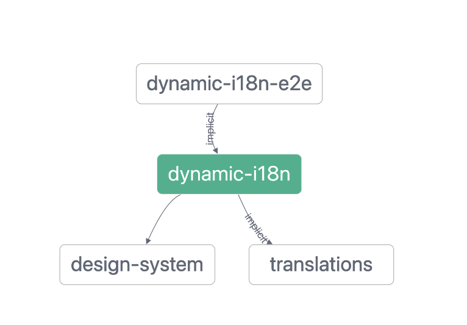

# Monorepo pattern


- [x] automatically create boilerplate code using generators uniformly and consistently
- [x] dependencies are updated anytime anything is changed in any project 
## How to setup namespaces with TS for relative imports

- module resolution

[How to use paths-mapping with typescript?](https://stackoverflow.com/questions/43281741/how-to-use-paths-in-tsconfig-json)
- multiple fallbacks

https://stackoverflow.com/a/47796714/1915935
https://stackoverflow.com/questions/43281741/how-to-use-paths-in-tsconfig-json

## Cheaveats

- Do not remove project.json file

## NX Tooling



- `nx affected --target=test` will run the test executor on every project that is affected by the current code change.
- [Run make commands from NX executor](https://nx.dev/executors/run-commands-builder)
- Chaining commands, interpolating args and setting the cwd
- Arguments forwarding
- [scaffoled a new nx-plugin](https://github.com/nrwl/nx/tree/master/packages/create-nx-plugin)
## NX devkit

- developing custom generators, executors and plugins
- Automation -> Speed & Quality
  - Improve DX and Standardization
- NX devkit API, AST exploration for low level stuff

| concepts   | description                                                                         |
| ---------- | ----------------------------------------------------------------------------------- |
| Generators | generate files from templates                                                       |
| Executors  | execute the file/script, building, linting, testing, serving and many other actions |
| plugin     | Generator + Executor, publish to npm                                                |

- Support different languages, (Java, Go, Python, C#)
- Compile new UI framework components
- Deploy an app on a CDN
- Publish to NPM


```
npx create-nx-plugin my-org --pluginName my-plugin

nx generate @nrwl/nx-plugin:generator [generatorName] --project=[pluginName]
nx generate @nrwl/nx-plugin:executor [executor] --project=[pluginName]
```
### Types og NX generators

1. NX core plugin generators
2. Migration generators
3. Workspace generators

Need to pre-compile the generator before using it into any workspace or sharing = Plugins (*most value)

## Learna vs NX

[Whaat is the diff b/w learna and NX?](https://stackoverflow.com/questions/67000436/the-difference-between-nx-and-lerna-monorepos)

Lerna is focused on **linking multiple packages** from the same project and managing npm publishing, and that's about it.

Nx is more focused on managing **development workflow** for multiple packages. It means it can scaffold packages, and for every package, you can define configurations on how to run and build them, in a similar manner to Webpack.