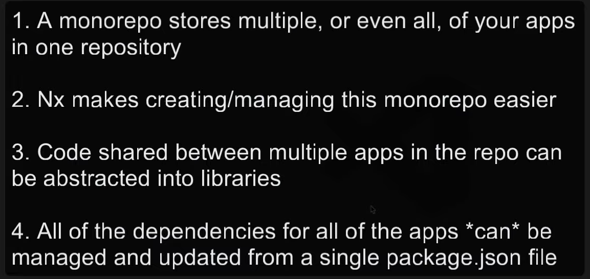

# Monorepo pattern

- [x] automatically create boilerplate code using generators uniformly and consistently
- [x] dependencies are updated anytime anything is changed in any project 
## How to setup namespaces with TS for relative imports

- module resolution

[How to use paths-mapping with typescript?](https://stackoverflow.com/questions/43281741/how-to-use-paths-in-tsconfig-json)
- multiple fallbacks

https://stackoverflow.com/a/47796714/1915935
https://stackoverflow.com/questions/43281741/how-to-use-paths-in-tsconfig-json

## Cheaveats

- Do not remove project.json file

## NX devkit

- developing custom generators, executors and plugins
- Automation -> Speed & Quality

### Types og NX generators

1. NX core plugin generators
2. Migration generators
3. Workspace generators